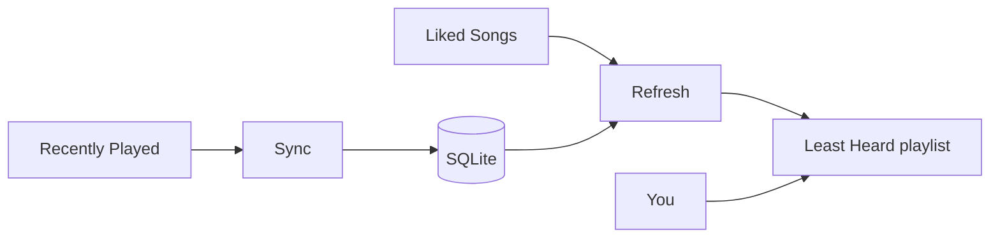

# Spot Shuffle

A small Python app that keeps a Spotify playlist sorted by **least recently heard** tracks from your Liked Songs.

Licensed under the [MIT License](LICENSE).

Spotify shuffle often repeats recent tracks and buries older ones. Spot Shuffle tracks when you last heard each liked song (in a local SQLite database) and rebuilds a **Least Heard** playlist so you can open it and press Play — no shuffle needed.

## How it works

1. **Sync** — polls Spotify's recently-played endpoint (last 50 plays) and updates local play history
2. **Refresh** — fetches all Liked Songs, sorts by oldest `last_played_at` (never-heard first), and rewrites a dedicated playlist
3. **Listen** — open the playlist in Spotify and play linearly



## Setup

### 1. Create a Spotify app

1. Go to [Spotify Developer Dashboard](https://developer.spotify.com/dashboard)
2. Create an app
3. Add redirect URI: `http://127.0.0.1:8080/callback`
4. Copy Client ID and Client Secret

### 2. Install

```bash
cd spot-shuffle
python -m venv .venv
source .venv/bin/activate
pip install -r requirements.txt
cp .env.example .env
# Edit .env with your credentials
```

### 3. Authorize (one time)

```bash
python -m spot_shuffle.cli auth
```

This opens your browser, completes OAuth, and saves tokens to `.tokens.json`.

### 4. Run

```bash
# Sync play history from Spotify
python -m spot_shuffle.cli sync

# Rebuild the Least Heard playlist
python -m spot_shuffle.cli refresh

# Check stats
python -m spot_shuffle.cli status
```

## Server / cron

Run sync + refresh every 15 minutes:

```bash
python -m spot_shuffle.cli run
```

Or via cron:

```cron
*/15 * * * * cd /path/to/spot-shuffle && .venv/bin/python -m spot_shuffle.cli sync && .venv/bin/python -m spot_shuffle.cli refresh
```

## Configuration

| Variable | Default | Description |
|----------|---------|-------------|
| `SPOTIFY_CLIENT_ID` | — | Spotify app client ID |
| `SPOTIFY_CLIENT_SECRET` | — | Spotify app client secret |
| `SPOTIFY_REDIRECT_URI` | `http://127.0.0.1:8080/callback` | OAuth redirect |
| `SPOTIFY_PLAYLIST_NAME` | `Least Heard` | Target playlist name |
| `SPOTIFY_DB_PATH` | `data/spot_shuffle.db` | SQLite database path |
| `SPOTIFY_TOKENS_PATH` | `.tokens.json` | OAuth token storage |
| `SYNC_INTERVAL_MINUTES` | `15` | Interval for `run` command |

## CLI commands

| Command | Description |
|---------|-------------|
| `auth` | One-time Spotify authorization |
| `sync` | Pull recently-played into local DB |
| `refresh` | Rebuild Least Heard playlist |
| `status` | Show library and history stats |
| `run` | Loop sync + refresh on an interval |

## Tests

```bash
python -m unittest discover -s tests -v
```

## Notes

- Spotify only exposes the **last 50 plays** via API; the local DB accumulates history over time as sync runs
- Tracks never recorded in the DB are treated as never played and appear first (shuffled among themselves)
- Liked Songs outside this app still get tracked when they appear in recently-played
